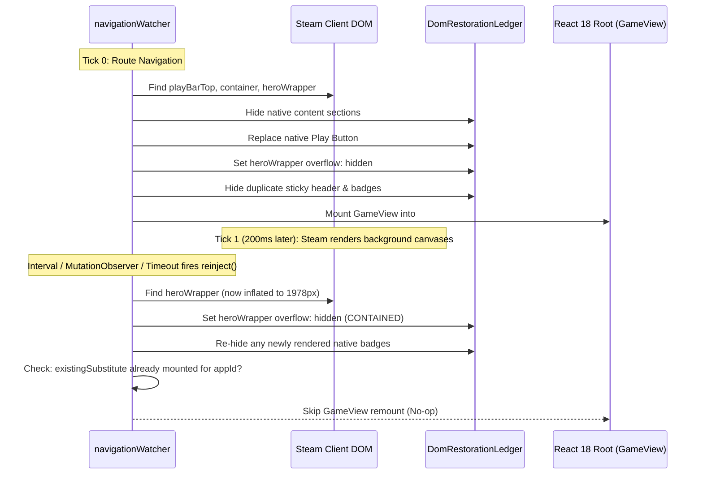

# Desktop Mode DOM Adaptation & Lifecycle Architecture

How Tender adapts Steam Desktop mode to display RomM game details, manage shortcuts, and handle the desktop lifecycle
without Decky Loader, monkey-patching, or fragile CSS scraping.

---

## Dual-Window Execution Model

Tender operates across two separate Chromium Embedded Framework (CEF) window contexts in Steam Desktop mode:

```mermaid
flowchart TD
    subgraph Daemon [Backend Daemon (backend/main.py)]
        CEF[CEF Remote Debugging Port 8080/8081]
    end

    subgraph SharedContext [SharedJSContext Window]
        Globals[dist/globals.js (SP_* React)]
        Index[dist/index.js (Tender Supervisor)]
        DeskSupervisor[startDesktopNavigationWatcher]
    end

    subgraph DesktopWindow [Steam Desktop Client Window (vgui_root / Library)]
        SteamDOM[Steam Desktop DOM Tree]
        OverviewPanel[AppDetailsOverviewPanel]
        HeroBanner[Hero Banner (Canvases)]
        InPagePlayBar[Play Bar Container]
        Substitute[#tender-desktop-cards-container (GameView)]
    end

    CEF -->|Inject Script| SharedContext
    DeskSupervisor -->|Window Polling / DevTools| DesktopWindow
    DeskSupervisor -->|Mount / Adapt| SteamDOM
```

1. **SharedJSContext**: The headless background context where Tender's bundle (`dist/globals.js` and `dist/index.js`) is
   injected via CEF remote debugging. It hosts the supervisor daemon, WebSocket connection to the backend, and
   background sync managers.
2. **Desktop Client Window**: The visible desktop window (named `vgui_root` or `Steam Desktop Client`) containing the
   library overview, play bar, and game details.

Because plugin code executes from `SharedJSContext` while targeting nodes in the desktop client's window, the two
documents belong to separate JavaScript execution realms. An `instanceof` check against a DOM global (e.g. `Element` or
`Window`) will evaluate to `false` across realms. All constructors and observers must be drawn from the target node's
own realm (`el.ownerDocument.defaultView`).

---

## Architectural Principles

### 1. Read-Only React Fiber Introspection (`watcher/fiberInspector.ts`)

In Big Picture mode, Tender patches into Steam's UI using Decky UI internals and component interception. In Desktop
mode, however, attempting to monkey-patch React reconciler internals or inject synthetic Fiber trees across execution
realms creates severe memory safety hazards and crashes the CEF renderer.

Instead, Tender employs **Read-Only React Fiber Introspection**:

- Inspects the internal `__reactFiber$` expando property attached to native DOM elements.
- Reads component identities (`displayName` or `type.name`) to identify Steam structures (e.g.
  `AppDetailsOverviewPanel`, `RightControls`, `PlayBarContainer`) without relying on ephemeral classes.
- Extracts domain state directly from Fiber props (e.g. `overview.appid`, `details.nAppId`) when route URLs are missing
  or ambiguous.
- **Strict Invariant**: Fiber structures are strictly read-only. Never modify Fiber nodes, hooks, props, or linked
  lists.

### 2. Atomic DOM Restoration Ledger (`watcher/restorationLedger.ts`)

Desktop UI adaptations mutate native Steam DOM nodes (hiding default non-Steam placeholder notices, replacing play
buttons, clipping overflow, and setting auto margins). An untracked DOM mutation causes permanent layout corruption when
navigating to non-RomM shortcuts or official Steam games.

The **`DomRestorationLedger`** guarantees atomic, idempotent restoration:

- **Style Recording**: When setting inline styles (e.g. `overflow: hidden`, `margin-left: auto`), the element's
  _original_ pre-mutation style is preserved in an internal map. Successive mutations preserve the earliest recorded
  value.
- **Visibility Tracking**: Hiding elements (`ledger.hide(el)`) backs up the initial `display` property and sets
  `display: none`. `ledger.unhide(el)` restores the exact prior display state.
- **Root Tracking**: Mounted React 18 roots (`client.createRoot(host)`) are tracked alongside their host container.
- **Listener Tracking**: Attached event listeners are registered for guaranteed teardown.
- **Atomic Teardown**: `ledger.restoreAll()` unmounts all React roots, clears registered event listeners, and restores
  all original element styles and displays in a single atomic pass upon unmount, route switch, or window unload.

### 3. Multi-Tier Resilient Selection Ladder (`watcher/elementSelectors.ts`)

Steam client desktop updates frequently re-minify and regenerate Webpack class names (e.g. `_3fLoY...`, `_3by_V...`).
Hardcoding these hashes creates brittle points of failure.

Tender resolves elements using a 4-tier fallback ladder:

| Tier       | Strategy                   | Description                                                           | Example                                                        |
| :--------- | :------------------------- | :-------------------------------------------------------------------- | :------------------------------------------------------------- |
| **Tier 1** | Webpack CSS Module / Fiber | Exact tokens from `deckyUiInternals` or read-only Fiber `displayName` | `appDetailsClasses.PlayBar`, Fiber `AppDetailsOverviewPanel`   |
| **Tier 2** | Semantic & ARIA Attributes | Accessibility labels, ARIA roles, or stable attributes                | `button[aria-label="Play Game"]`, `[role="tab"]`               |
| **Tier 3** | Class Substring Tokens     | Hyphen/underscore-bounded stable semantic name segments               | `[class*="playbar_"]`, `[class*="gameoverview_"]`              |
| **Tier 4** | Structural Tree Walk       | Traversal based on known parent/child layout relationships            | Nearest common ancestor between `playBar` and content sections |

**Rule**: Ephemeral minified class hashes are strictly forbidden in code.

---

## Continuous Adaptation & The Async Layout Shift Trap

### The Lifecycle Problem

When a user selects a game in the desktop library:

1. Steam constructs the initial DOM skeleton (`overviewPanel`, `playBar`).
2. Tender's watcher detects the route and mounts `TENDER_SUBSTITUTE_ID` (`GameView`).
3. **Asynchronously (100–500ms later)**: Steam's background threads render blurred background gradient canvases into the
   hero wrapper.
4. These canvas elements have natural dimensions exceeding the container, inflating the hero wrapper's `scrollHeight`
   from ~307px to 1978px (with `overflow: visible`).
5. This creates an enormous empty gap below the game cards, allowing the user to scroll endlessly past content.

### The Pass Order Invariant

An agent or developer might instinctively short-circuit `reinject()` if `existingSubstitute` is already mounted:

```ts
// ❌ DANGEROUS: Short-circuiting early breaks async layout adaptations!
if (existingSubstitute && existingSubstitute.isConnected && existingSubstitute.dataset.appid === String(appId)) {
  return;
}
// Hero wrapper overflow clipping, badges hiding, and duplicate sticky bar suppression NEVER RUN!
```

Because `GameView` mounts on tick 0 before the canvases render, returning early skips all subsequent layout containment.

**The Invariant**: In `reinject()`, **DOM adaptations must precede the substitute mount guard**:



1. **Step 1–7 (Always Execute)**: Hide native content sections, replace Play button, clip hero wrapper overflow, hide
   duplicate sticky headers, hide native badges, align right controls.
2. **Step 8 (Gated)**: If `existingSubstitute` is connected for the current `appId`, return. Only instantiate or unmount
   the `GameView` React root when navigating to a new game or if the container detached.

### Continuous Adaptation Mechanisms

To ensure layout containment remains locked regardless of when Steam finishes rendering:

- **Polling Loop (`checkNav`)**: Runs every 250ms via `deskWin.setInterval`. When `isMountedForCurrent` is true, it
  still calls `reinject()` to catch asynchronous layout shifts.
- **MutationObserver**: Observes `deskWin.document.body` for child list and subtree mutations.
- **Scroll Synchronization (`stickyPlayBarController.ts`)**: When the user scrolls, `updatePinning()` recalculates play
  bar glass/solid styling and validates that `heroWrapper` overflow remains clipped.

---

## Feature Parity & Roadmap

For a comprehensive comparison of features implemented in Big Picture mode versus Desktop mode, as well as the
multi-phase development roadmap for desktop parity, see the
[Desktop vs. Big Picture Feature Parity Matrix](desktop-parity-matrix.md).
