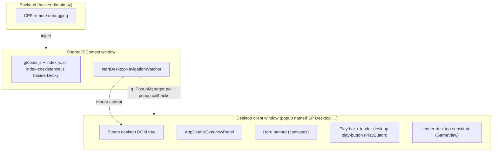
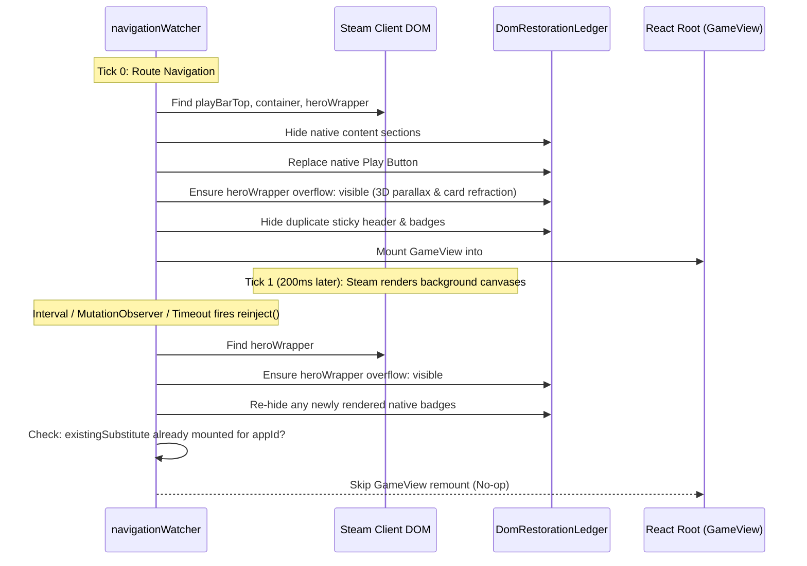

# Desktop Mode DOM Adaptation & Lifecycle Architecture

How Tender adapts Steam Desktop mode to display RomM game details, manage shortcuts, and handle the desktop lifecycle
without Decky Loader, monkey-patching, or fragile CSS scraping.

> **Dev build only.** Nothing on this page is in a shipped bundle. The watcher reaches Steam only through
> `pnpm -C frontend build:desktop`, which adds it to `src/index.tsx` at build time
> ([the desktop dev build](frontend-bundles.md#the-desktop-dev-build-dev-build-only)); `pnpm build`, `mise run dev`, CI
> and the release tarball carry none of `frontend/src/desktop/`.

---

## Dual-Window Execution Model

Tender operates across two separate Chromium Embedded Framework (CEF) window contexts in Steam Desktop mode:


```mermaid
flowchart TD
    subgraph Daemon ["Backend (backend/main.py)"]
        CEF["CEF remote debugging"]
    end

    subgraph SharedContext ["SharedJSContext window"]
        Panel["globals.js + index.js, or index-coexistence.js beside Decky"]
        DeskSupervisor["startDesktopNavigationWatcher"]
    end

    subgraph DesktopWindow ["Desktop client window (popup named SP Desktop …)"]
        SteamDOM["Steam desktop DOM tree"]
        OverviewPanel["AppDetailsOverviewPanel"]
        HeroBanner["Hero banner (canvases)"]
        InPagePlayBar["Play bar + tender-desktop-play-button (PlayButton)"]
        Substitute["tender-desktop-substitute (GameView)"]
    end

    CEF -->|"inject"| SharedContext
    DeskSupervisor -->|"g_PopupManager poll + popup callbacks"| DesktopWindow
    DeskSupervisor -->|"mount / adapt"| SteamDOM
```

1. **SharedJSContext**: The background context the backend injects the panel into over CEF remote debugging —
   `dist/globals.js` then `dist/index.js`, or `dist/index-coexistence.js` alone beside a serving Decky Loader
   ([loading the panel](loading-the-panel.md#which-bundles-and-the-rule-that-cannot-bend)). It hosts the desktop
   supervisor, the WebSocket connection to the backend, and the background sync managers.
2. **Desktop Client Window**: The popup `g_PopupManager.GetPopups()` lists under a name starting with `SP Desktop`
   (`findDesktopWindow`, `desktop/desktopWindow.ts`), containing the library overview, play bar, and game details. The
   supervisor looks for it on start, every 500 ms, and whenever Steam reports a popup created or destroyed; it detaches
   from a window that closed or was replaced and attaches to the new one.

Because plugin code executes from `SharedJSContext` while targeting nodes in the desktop client's window, the two
documents belong to separate JavaScript execution realms. An `instanceof` check against a DOM global (e.g. `Element` or
`Window`) will evaluate to `false` across realms. All constructors and observers must be drawn from the target node's
own realm (`el.ownerDocument.defaultView`).

### Which window is Steam's main UI

Measured in Steam's `SharedJSContext` on a Steam Deck in Desktop Mode:

- `SteamUIStore.MainInstanceUIMode` reads **7** while the desktop client is the main window (`SP Desktop_uid0`) and
  **4** while Big Picture is (`SP BPM_uid0`), and reads 7 again after leaving Big Picture.
- Steam **replaces** the main window rather than layering one over the other: while Big Picture was open, no
  `SP Desktop` popup was in `g_PopupManager.GetPopups()`, and after returning a **new** `SP Desktop_uid0` window
  existed. A reference to the desktop window does not outlive a trip through Big Picture, which is why the supervisor
  re-finds it.
- With the desktop client closed to the tray, the mode stays 7, the `SP Desktop_uid0` popup still exists,
  `MainWindowVisible` is true and the window's `document.hidden` is false. From JavaScript, a window hidden in the tray
  cannot be told apart from an open one.
- Game Mode was not measured. Tender reads every mode other than 7, and an unreadable `SteamUIStore`, as the desktop
  client not being the main UI.

### Dialogs for a start the launch watcher catches

A start Tender's Play button did not make — Steam's own Play, a `steam://rungameid` link — is caught by the launch
watcher (`utils/launchInterceptor.ts`), which may have questions to ask before the game starts. Which surface draws them
is decided once per start, as its gate begins, by `launchPromptsForThisStart` (`utils/launchPromptRouter.ts`): the
desktop dialogs while `MainInstanceUIMode` is 7 and the desktop surface has offered them and has a window, and Steam's
gamepad modals otherwise. The desktop surface offers them from `startDesktopSurface` and withdraws them from
`stopDesktopSurface` (`desktop/index.ts`), so a bundle without the desktop surface — every shipped one — always asks
through the gamepad modals.

Such a start has no Tender page to draw from, so `askInDesktopWindow` (`desktop/launchPromptHost.tsx`) draws each
question into the body of the desktop window that exists at the moment it is asked: a container created with that
window's own `document.createElement`, and a React root from `findReactClient`. Each question keeps a
`DomRestorationLedger` of its own, which records the root, its container and the window's `pagehide` and `unload`
listeners, and `restoreAll()` takes all of it away when the question settles. A question settles with the button
pressed; with its dismissed answer on Escape or a click on the backdrop (as every `DesktopDialog` does), when its window
goes, or when the surface is withdrawn; and at once, with its dismissed answer, when there is no desktop window or
`createRoot` to draw with. Two starts caught together each draw a dialog of their own, one over the other, and Escape
then dismisses both.

**Known limitation:** because a tray-hidden desktop window looks open, a question for a start caught while the desktop
client sits in the tray is drawn into a window nobody sees until Steam is opened again, and the start waits for it. The
gamepad modals had the same exposure.

---

## Architectural Principles

### 1. Read-Only React Fiber Introspection (`watcher/fiberInspector.ts`)

In Big Picture mode, Tender patches into Steam's UI using Decky UI internals and component interception. In Desktop
mode, however, attempting to monkey-patch React reconciler internals or inject synthetic Fiber trees across execution
realms creates severe memory safety hazards and crashes the CEF renderer.

Instead, Tender employs **Read-Only React Fiber Introspection**:

- Inspects the internal `__reactFiber$` (or `__reactInternalInstance$`) expando property attached to native DOM
  elements.
- Reads component identities (`displayName` or `type.name`, walking up to the nearest non-HTML-tag name) to identify
  Steam structures (e.g. `PlayButton`, `AppActionButton`, the play bar and right controls).
- Reads the appId from the nearest ancestor's props — `appId`, `overview.appid` or `details.appid` — when the route
  (`MainWindowBrowserManager.m_lastLocation.pathname`, `/library/app/<appId>`) does not yield one.
- **Strict Invariant**: Fiber structures are strictly read-only. Never modify Fiber nodes, hooks, props, or linked
  lists.

### 2. Atomic DOM Restoration Ledger (`watcher/restorationLedger.ts`)

Desktop UI adaptations mutate native Steam DOM nodes (hiding default non-Steam placeholder notices, replacing play
buttons, making the play bar sticky, keeping the hero wrapper's overflow visible, and setting auto margins). An
untracked DOM mutation causes permanent layout corruption when navigating to non-RomM shortcuts or official Steam games.

The **`DomRestorationLedger`** guarantees atomic, idempotent restoration:

- **Style Recording**: When setting inline styles (e.g. `position: sticky`, `margin-left: auto`), the element's
  _original_ pre-mutation style is preserved in an internal map. Successive mutations preserve the earliest recorded
  value.
- **Visibility Tracking**: Hiding elements (`ledger.hide(el)`) backs up the initial `display` property and sets
  `display: none`. `ledger.unhide(el)` restores the exact prior display state.
- **Root Tracking**: Mounted React roots are tracked alongside their host container. `createRoot` is found in Steam's
  module registry (`findReactClient`, `desktop/desktopWindow.ts`), because Steam's React 19 keeps it in its own client
  module rather than on `SP_REACTDOM`. That lookup sweeps the whole registry, so the watcher makes it once per window it
  attaches to and keeps the answer.
- **Listener Tracking**: Attached event listeners are registered for guaranteed teardown.
- **Atomic Teardown**: `ledger.restoreAll()` detaches registered event listeners, unmounts all React roots and removes
  their hosts, then restores original displays and inline styles, in one pass — when the page leaves a RomM shortcut,
  when it moves to another RomM game, and when the watcher detaches from the window. A pass or a sticky-bar settle timer
  scheduled before that teardown does nothing once it has run, and the supervisor's popup callbacks, which nothing
  unregisters, do nothing once it has stopped.

### 3. Multi-Tier Resilient Selection Ladder (`watcher/elementSelectors.ts`)

Steam client desktop updates frequently re-minify and regenerate Webpack class names (e.g. `_3fLoY...`, `_3by_V...`).
Hardcoding these hashes creates brittle points of failure.

Each finder tries these strategies in order and takes the first that answers. Not every finder uses every rung, and a
finder may reorder the middle three (`findSteamPlayButton`, for one, checks a candidate's Fiber name before its ARIA
label and its text):

| Rung  | Strategy                 | Description                                                                                | Example                                                                                |
| :---- | :----------------------- | :----------------------------------------------------------------------------------------- | :------------------------------------------------------------------------------------- |
| **1** | Webpack CSS module token | The exact class `@decky/ui` resolved from Steam's own modules (`utils/deckyUiInternals`)   | `appDetailsClasses.PlayBar`, `appActionButtonClasses.PlayButtonContainer`              |
| **2** | Class-name substring     | The readable, PascalCase part of a module class name, which survives a re-hash of the rest | `[class*="PlayBar"]`, `[class*="AppDetailsOverviewPanel"]`, `[class*="RightControls"]` |
| **3** | Read-only Fiber name     | The nearest component name on the element's Fiber                                          | `/PlayButton\|AppActionButton/` on `getFiberDisplayName(el)`                           |
| **4** | ARIA label and text      | Accessible labels and visible text                                                         | `aria-label` matching `play`, `resume` or `launch`; a leaf reading `PLAY`              |
| **5** | Structural tree walk     | Traversal based on known parent/child layout relationships                                 | Nearest common ancestor between the play bar and the content sections                  |

**Rule**: Ephemeral minified class hashes are strictly forbidden in code. The hash-like names further down this page
describe Steam's DOM as measured; they are not selectors.

---

## Continuous Adaptation & The Async Layout Shift Trap

### The Lifecycle Problem

When a user selects a game in the desktop library:

1. Steam constructs the initial DOM skeleton (`overviewPanel`, `playBar`).
2. Tender's watcher detects the route and mounts `TENDER_SUBSTITUTE_ID` (`GameView`).
3. **Asynchronously (100–500ms later)**: Steam renders the rest of the page — the blurred background gradient canvases
   in the hero wrapper, the play bar's badges, and its duplicate sticky header.
4. An adaptation made only at mount never sees those elements: the badges and the duplicate header stay on screen, and
   the hero wrapper, which `findInflatedHeroWrapper` recognises by the canvases inflating its `scrollHeight`, is not
   there yet to be kept at `overflow: visible`.

### The Pass Order Invariant

An agent or developer might instinctively short-circuit `reinject()` if `existingSubstitute` is already mounted:

```ts
// ❌ DANGEROUS: Short-circuiting early breaks async layout adaptations!
if (existingSubstitute && existingSubstitute.isConnected && existingSubstitute.dataset.appid === String(appId)) {
  return;
}
// Keeping the hero wrapper visible, hiding badges, and duplicate sticky bar suppression NEVER RUN!
```

Because `GameView` mounts on tick 0 before the rest of the page renders, returning early skips every adaptation for what
renders later.

**The Invariant**: In `reinject()`, **DOM adaptations must precede the substitute mount guard**:


```mermaid
sequenceDiagram
    participant Watcher as navigationWatcher
    participant SteamDOM as Steam Client DOM
    participant Ledger as DomRestorationLedger
    participant ReactRoot as React Root (GameView)

    Note over Watcher: Tick 0: Route Navigation
    Watcher->>SteamDOM: Find playBarTop, container, heroWrapper
    Watcher->>Ledger: Hide native content sections
    Watcher->>Ledger: Replace native Play Button
    Watcher->>Ledger: Ensure heroWrapper overflow: visible (3D parallax & card refraction)
    Watcher->>Ledger: Hide duplicate sticky header & badges
    Watcher->>ReactRoot: Mount GameView into #tender-desktop-substitute

    Note over SteamDOM: Tick 1 (200ms later): Steam renders background canvases
    Note over Watcher: Interval / MutationObserver / Timeout fires reinject()
    Watcher->>SteamDOM: Find heroWrapper
    Watcher->>Ledger: Ensure heroWrapper overflow: visible
    Watcher->>Ledger: Re-hide any newly rendered native badges
    Watcher->>Watcher: Check: existingSubstitute already mounted for appId?
    Watcher-->>ReactRoot: Skip GameView remount (No-op)
```

1. **First, a stale `GameView`**: a substitute carrying another `appId`, or no longer in the insertion container, is
   torn down with everything the ledger holds. This happens before the adaptations, because a teardown after them would
   restore every one of them and leave Steam's own play bar on screen until the next pass.
2. **Always executed**, in this order: hide the native content sections; hide the native Play button and mount
   `PlayButton` in a root of its own beside it (remounted only when missing, detached, for another appId, or moved); set
   up or refresh the sticky play bar controller; keep the hero wrapper's overflow `visible`; hide Steam's duplicate
   sticky header; hide the native play bar badges; push the right controls to the right edge.
3. **Gated**: if a `GameView` for the current `appId` is still in place, return. Otherwise mount one after the play bar.

The watcher imports neither view: it draws what `startDesktopNavigationWatcher` is handed (`DesktopGamePage`), and
`startDesktopSurface` (`desktop/index.ts`) hands it `GameView` and `PlayButton`. A part it is not handed leaves Steam's
own in place — without a `gameView` the content sections stay and nothing is mounted after the play bar; without a
`playButton` Steam's Play button and its badges stay. The play bar, hero, duplicate-header and right-control adaptations
run either way.

### Continuous Adaptation Mechanisms

To ensure layout containment remains locked regardless of when Steam finishes rendering:

- **Polling Loop (`checkNav`)**: Runs every 250ms via `deskWin.setInterval`. When `isMountedForCurrent` is true, it
  still calls `reinject()` to catch asynchronous layout shifts.
- **MutationObserver**: Observes `deskWin.document.body` for child list and subtree mutations.
- **RomM appId changes**: `onRomMAppIdsChanged` (`utils/rommAppIds.ts`) runs `reinject()` when the set of RomM shortcuts
  changes, so a page opened before its shortcut was registered is adapted once it is. Changes made in one synchronous
  run — start-up registers the whole appId map in a loop — arrive as one call, and a registration that changes nothing
  arrives not at all.
- **Settle timeouts**: every path change, and every attach to a window, also schedules `reinject()` at 100, 300 and 600
  ms.
- **Scroll Synchronization (`stickyPlayBarController.ts`)**: When the user scrolls, `updatePinning()` recalculates play
  bar glass/solid styling while maintaining `heroWrapper` overflow `visible` to allow the hero banner to scroll in 3D
  parallax behind the cards.

---

## Hero Banner Parallax & Glass Refraction Architecture

Steam Desktop's game details page features a signature visual effect where the hero banner artwork bleeds through a
semi-transparent glass play bar and scrolls at half speed behind content cards.

### Mechanics & Stacking Context

- **3D Parallax Perspective**:
  - The scroller (`_3lDczhulqraStjCitLYJ1K`) defines a 3D perspective context via
    `perspective: 1px; overflow-y: scroll;`.
  - The hero banner ancestors (`_2gZXhRmKUk68pA28-5ZmGQ` and `NZMJ6g2iVnFsOOp-lDmIP`) declare
    `transform-style: preserve-3d; overflow: visible;`.
  - The hero image container (`_1IX7FPSY9Jb82KhBVBSkZa`) applies
    `transform: matrix3d(2, 0, 0, 0, 0, 2, 0, 0, 0, 0, 1, 0, 0, 0, -1, 1)` (`scale(2) translateZ(-1px)`). In a 1px
    perspective context, `translateZ(-1px)` halves the scroll rate (0.5x parallax) while `scale(2)` scales the image
    back to 100% visual size.
  - The hero layer sits on `z-index: -1000`, placing it below normal document flow.

- **Play Bar Glass Overlay**:
  - **Unpinned**: `GLASS_PLAY_BAR_BG` (`rgba(36, 40, 47, 0.15)`) + subtle `GLASS_PLAY_BAR_GRADIENT` with
    `backdrop-filter: blur(12px)` on `z-index: 10`. The parallaxing hero banner bleeds through with a frosted refraction
    effect.
  - **Pinned**: When the play bar reaches the top of the scroller, `isPlayBarPinned` transitions the play bar to
    `SOLID_PLAY_BAR_BG` (`rgb(39, 44, 53)`) with `PINNED_PLAY_BAR_SHADOW`.

- **Card Refraction Persistence**:
  - The Tender cards container sits at `z-index: 1`. Each card uses a semi-transparent radial gradient
    (`STEAM_CARD_BG`).
  - Because `heroWrapper` preserves `overflow: visible`, the hero banner continues to scroll in 3D parallax behind the
    cards even after the play bar pins to the top, providing continuous artwork refraction across the remaining content.

### Bounding the artwork's overflow (`boundHeroOverflow`)

The hero image container — the parallax layer — is 307px tall, but what it holds runs much further: the image, then a
canvas Steam flips vertically to continue the blurred background below it (989px in all on the page measured). Chromium
counts that overflow towards the scroller's scrollable height at the layer's own scale, so on that page the scroller
reached 2 × 989 = 1978px against content ending at 1405px, and the page scrolled on past the last card into empty space.

Clipping the hero wrapper removes that, and flattens the parallax with it (above). `boundHeroOverflow`
(`watcher/stickyPlayBarController.ts`) clips one level lower instead, on the parallax layer itself, which is the end of
the 3D chain and already `transform-style: flat`, so nothing above it changes:

- **`overflow: clip`** on the layer, with an **`overflow-clip-margin`** that lets the artwork run on exactly as far as
  the page does. The layer's scrollable bottom is `layerTop + scale × (layer height + margin)`, measured on the device
  for margins from 400 to 600px, so the margin is `(target − layerTop) / scale − layer height`, rounded down. The target
  is the content's bottom, or the scroller's own height on a page shorter than the window.
- **A fade on the flipped canvas** over its last 160px before the clip edge, so the artwork ends in a gradient rather
  than on a straight line. The mask goes on the canvas rather than the layer: on the layer, a mask covers only the
  layer's own box, however its `mask-clip` is set, so it never reached the overflow.

Both are recomputed whenever the sticky controller updates its pinning — on scroll, on resize, and on every watcher pass
— because the cards change height, and both go through the ledger.

---

## The Tender Settings Window (planned)

> **Planned, not built.** Nothing in this section exists in the source tree: `frontend/src/desktop/` opens no window of
> its own and touches no Steam menu. The section records what Steam's own settings window and its "Steam" menu were
> measured to be, and the plan for a "Tender Settings" window built from the same parts. The feature-by-feature mapping
> and the ordered steps are on the parity matrix
> ([Phase 2](desktop-parity-matrix.md#phase-2-the-tender-settings-window-medium-priority)). The decisions at the end of
> this section are settled; the device checks beside them gate the first PR.

### What Steam's settings window is

Read on the device (SteamOS, desktop client) on 2026-10-04, without opening, pressing or changing anything:

- **It is not a separate web page.** The "Steam Settings" window is an `about:blank` popup —
  `about:blank?createflags=4114&minwidth=850&minheight=722` — whose document SharedJSContext's React fills through a
  portal. Through the creation-flag enum in Steam's `library.js`, `4114` is Hidden | Resizable |
  ApplyBrowserScaleToDimensions: the component asks for the last two, and the popup layer adds Hidden, creating the
  window hidden and then showing it.
- **It is drawn by a generic popup component**, the one Steam uses for any React-filled popup window. Steam's settings
  host renders it with `popupWidth={850} popupHeight={722} minWidth={850} minHeight={722} resizable modal={false}`, a
  title, an `onDismiss` and a title-bar class. The component creates the window through Steam's popup hook (with
  `html_class: "client_chat_frame fullheight ModalDialogPopup"`), sets its `document.title`, copies Steam's stylesheets
  into it, saves its size under a `saveDimensionsKey`, and portals in a `PopupFullWindow` holding Steam's `TitleBar`
  (close, maximise, minimise), a modal-manager root for its children and, when resizable, a resize grip.
- **Inside the frame**: a `MemoryRouter`, then Steam's `SidebarNavigation` — the component `@decky/ui` exports under
  that name — then `PagedSettings`. The rows are Steam's `Field` and `DialogButton` under `DialogHeader` / `DialogBody`,
  all of which `@decky/ui` exports too.
- **Steam opens it from a store flag.** `steam://settings` sets a settings store visible with a target page, and an
  always-mounted host renders the popup while the flag is set. Opening it again while it is open brings the existing
  window to the front and navigates it to the page asked for.

| Part           | Measured                                                                                                   |
| :------------- | :--------------------------------------------------------------------------------------------------------- |
| Window         | 850 × 722 by default and at minimum, resizable; the popup's `body` carries `DesktopUI`                     |
| Title bar      | 40 px, absolute and transparent over the content; three 32 × 32 window buttons                             |
| Sidebar column | about 198 px (160 to 220), background `rgb(42, 45, 52)`, 36 px of padding at the top                       |
| Sidebar title  | the `title` prop uppercased by CSS: 17 px, weight 700, `rgb(26, 159, 255)` — in the sidebar, not the bar   |
| Sidebar item   | a 40 px row, a 20 × 20 icon, 14 px text in `rgb(184, 188, 191)`; the active row white on `rgb(61, 68, 80)` |
| Separator      | 1 px `rgb(61, 68, 80)` inset by 12 px; transparent beside the active item                                  |
| Page header    | `DialogHeader`, 22 px, weight 700, white                                                                   |

The structural classes are readable (`PopupFullWindow`, `TitleBar`, `DialogContent`, `DialogHeader`, `DialogBody`,
`DialogButton`, `window_resize_grip`), but every sidebar item, separator, the sidebar title and every part of a `Field`
carries only CSS-module hashes. Those are reachable by **semantic key**: the sidebar component receives a `stylesheet`
prop, a CSS-module object that maps keys such as `PagedSettingsDialog_PageListItem`, `Active` and `PageListSeparator` to
the build's hashes. Anything Tender draws to look like this window resolves a class by its key in that object at
runtime, as the selection ladder's first rung takes tokens from Steam's modules, and never spells a hash
(`.claude/rules/desktop-dom.md` §1). Rendering Steam's own components avoids the question, because they apply their
classes themselves.

Webpack module numbers and minified names seen during that reading belong to the Steam build inspected on 2026-10-04 and
change between builds, so none is a way to find anything. Each part is found by a stable property instead: the popup
component by its source text (`"PopupWindow_"` beside `ModalDialogPopup`), `PagedSettings` by the name Steam registers
it under (`"PagedSettings"`), and `SidebarNavigation` by `@decky/ui`'s own prop-list lookup (`pages`,
`fnSetNavigateToPage`, `disableRouteReporting`).

### How the window is made

| Option                                 | What it is                                                                                                                                                                                                                  | Verdict                                                                                                                                                                                                                                                                                    |
| :------------------------------------- | :-------------------------------------------------------------------------------------------------------------------------------------------------------------------------------------------------------------------------- | :----------------------------------------------------------------------------------------------------------------------------------------------------------------------------------------------------------------------------------------------------------------------------------------- |
| **W1. Steam's popup component**        | Tender renders the component Steam's settings host renders, titled "Tender Settings", 850 × 722 and at least that, `resizable`, `modal={false}`, with an `onDismiss`; its own `MemoryRouter` and `SidebarNavigation` inside | **Chosen (D1).** The frame — title bar, window buttons, resize grip, copied stylesheets, saved size, `DesktopUI` body — is Steam's own code path. It costs a module lookup `@decky/ui` does not have, and centring on the owner window needs the window context Steam's host renders under |
| **W2. `showModal` popped out**         | `@decky/ui`'s `showModal(…, { bForcePopOut, popupWidth, popupHeight, strTitle })`: Steam's modal manager moves a modal into a window of its own                                                                             | Unverified. Probably a modal-dialog frame rather than the settings window's; the pop-out is undocumented, and the default parent is `findSP()`, a Big Picture lookup that may resolve wrongly in a desktop-only session                                                                    |
| **W3. A bare popup**                   | `window.open("about:blank?createflags=4114&minwidth=850&minheight=722", …)`, or `g_PopupManager`'s static `CreatePopup`, then `findReactClient().createRoot()` into it                                                      | **Fallback.** A native window with nothing in it: Tender supplies the title bar, the window controls, the stylesheets, the lifecycle and the saved size                                                                                                                                    |
| **W4. A dialog in the desktop window** | A modal portaled into the library window's `document.body` — the earlier Phase 2 plan                                                                                                                                       | Ruled out: a dialog inside the library window is not a window of its own                                                                                                                                                                                                                   |
| **W5. `SteamClient.BrowserView`**      | `BrowserView` / `BrowserView.CreatePopup` loading a URL: a separate web page                                                                                                                                                | Ruled out: a separate JavaScript context (below)                                                                                                                                                                                                                                           |

A `BrowserView` hosts a web page with a JavaScript context of its own. Everything the panel works with lives in
SharedJSContext: its one WebSocket to the backend (`api/host.ts`), every store under `utils/`, and the token the backend
put on the bundle it injected. A page of its own would have none of them; it would need a bundle and an admission of its
own, and the backend's per-process token is not built for a second page
([Talking to the backend](frontend-bundles.md#talking-to-the-backend)). W1 and W3 both keep every line of Tender's code
in SharedJSContext.

### The router trap

`SidebarNavigation` calls `history.replace(route)` whenever a page is chosen, and takes the history from the nearest
react-router context. Rendered under a tree that carries the main window's contexts — which W1 wants, for centring — it
would find **the library window's** router and move the library to a settings route. Tender's window therefore renders a
`MemoryRouter` of its own around `SidebarNavigation`, as Steam's settings host does. This is required, not a matter of
style, and no test here can show it: it is a device check.

### The "Tender Settings" menu entry

The menu bar's "Steam" button opens a context-menu instance. On the device that instance is created hidden and retained
in a popup of its own, titled **"Steam Root Menu"** (`body.ContextMenuPopupBody.DesktopUI`), so its document exists
while the menu is closed. Whether it is retained is decided by the menu button: it creates the instance hidden and
retains it on hide only where Steam reports no underlay support, the window is an overlay, or small mode is on. This
device is the first case. Elsewhere — underlay supported, small mode off — the instance is created on each open, is not
forced into a popup, so it may be drawn inside the library window's own document, and is dropped when it hides. The
retained popup does not outlive the library window either: a Big Picture round trip closes every menu popup with it, and
the return creates new ones. The items come from a static array built inside a component private to its Steam module, so
the array cannot be reached by replacing an export. The Settings entry is
`{ name: "#Menu_Settings", steamURL: "steam://settings", … }`, followed by a separator and Exit; an entry with no action
renders as a separator.

In the menu's document only `ContextMenuPopupBody`, `DesktopUI`, `visible` and `contextMenuItem` are readable classes.
The stable anchor is on the Fiber: the component above the Settings item carries `name: "#Menu_Settings"` and
`steamURL: "steam://settings"` in its props, and further up the context-menu host holds the menu's `instance`, with
`Show()` and `Hide()`.

| Option                                      | Mechanism                                                                                                                                                                                                                                                                                                                                                                                                                                                       | Fit and risk                                                                                                                                                                                                                                                                                                                                                                                                                                                                                                                                                                                   |
| :------------------------------------------ | :-------------------------------------------------------------------------------------------------------------------------------------------------------------------------------------------------------------------------------------------------------------------------------------------------------------------------------------------------------------------------------------------------------------------------------------------------------------- | :--------------------------------------------------------------------------------------------------------------------------------------------------------------------------------------------------------------------------------------------------------------------------------------------------------------------------------------------------------------------------------------------------------------------------------------------------------------------------------------------------------------------------------------------------------------------------------------------- |
| **M1. A DOM item in the "Steam Root Menu"** | Find the menu's popup through `g_PopupManager.GetPopups()`, with `AddPopupCreatedCallback` for a menu created late; anchor on the `contextMenuItem` whose Fiber props read `steamURL === "steam://settings"` (a read-only Fiber read); insert a sibling after it, copying that item's `className` at runtime; its click calls `openTenderSettings()` and hides the menu through its `instance`; record every insertion and listener in a `DomRestorationLedger` | **Chosen (D2).** Only techniques `.claude/rules/desktop-dom.md` already allows: DOM adaptation through the ledger, read-only Fiber reads, and no spelled hash, because the class is copied from the live sibling. Opening the retained menu replaced no node and did not re-render the Settings item (device check 2), but an observer from the menu document's realm still re-inserts the item should React drop it; every new "Steam Root Menu" popup, after each Big Picture round trip, gets the item again; keyboard navigation inside the menu may not reach an item React does not know |
| **M2. Wrap the menu component's `type`**    | Render the original, then append `{ name: "Tender Settings", onClick }` to the item list                                                                                                                                                                                                                                                                                                                                                                        | Steam renders the item, so hover, focus and keyboard behave natively. It is a Fiber write, which `.claude/rules/desktop-dom.md` §3 forbids (the same write as the half of `qam/installEntry.tsx`'s `adoptMountedMenu` that sets `node.type`), and the retained instance must be made to re-render. Adopting it reverses a written desktop rule, so it needs an ADR                                                                                                                                                                                                                             |
| **M3. `afterPatch` on a Steam export**      | Patch the item-list component through `@decky/ui`'s patcher                                                                                                                                                                                                                                                                                                                                                                                                     | Not a Fiber write, but the list is read through a webpack export getter at render time, so replacing the export most likely changes nothing; unproven                                                                                                                                                                                                                                                                                                                                                                                                                                          |
| **M4. Another entry point**                 | A gear button in the play bar or the title bar — the earlier Phase 2 idea                                                                                                                                                                                                                                                                                                                                                                                       | Ruled out: the entry belongs in Steam's "Steam" menu, beside Steam's own Settings                                                                                                                                                                                                                                                                                                                                                                                                                                                                                                              |

**M1 is the plan**, installed from `desktop/index.ts`, anchored on the Fiber's `steamURL` / `#Menu_Settings` and never
on the localised label "Settings" or a class. Its callbacks registered with Steam do nothing once the surface has
stopped, as the supervisor's do (`.claude/rules/desktop-dom.md` §2). Where Steam creates the menu on each open instead
of retaining it, the same callback sees each new popup, and a menu drawn inside the library window is found there. M2
stays documented as the fallback should a later Steam build wipe the inserted item on show. Hiding the menu through its
`instance` is allowed (D2): it is a method on Steam's menu object, not a reconciler call.

### Realms, the backend, and where it starts

The window is a third document beside SharedJSContext and the library window, and what the
[Dual-Window Execution Model](#dual-window-execution-model) says of the library window holds for it: listeners, timers
and observers are bound to the popup's own window, taken from the node (`el.ownerDocument.defaultView`) as
`DesktopDialog` does for Escape, and `instanceof` against a DOM global is false there. Two things run the other way:

- **`romm_data_changed` stays on SharedJSContext's global.** The settings logic dispatches it, and its listeners
  (`bigpicture/panelEvents.ts`, `utils/gameDetailStore.ts`) are in SharedJSContext. The logic's code runs there, so
  `window.dispatchEvent` already reaches them; "correcting" it to the popup's window would silence them.
- **Steam menus opened from inside the window** — a `Dropdown`, the emulator menu — need a parent in the popup's
  document, not `findSP()` or SharedJSContext.

happy-dom has one realm, so the suite sees none of this; each is a device check.

Components rendered into the popup are SharedJSContext code calling the same `api/host.ts`, so `endpoint()` and
`addEventListener()` reach the backend over the panel's one WebSocket unchanged, as the desktop `GameView` already does.
The window needs no endpoint the Big Picture pages do not already call.

- **Where it starts.** `startDesktopSurface` (`desktop/index.ts`) installs the menu entry beside the navigation watcher,
  and `stopDesktopSurface` withdraws it. The window and its tabs live in `desktop/settings/`, which
  `frontend/src/desktop/README.md` already plans. The window's React root is its own, not in the library window's
  document, and is recorded in a ledger of its own together with the popup's `pagehide` and `unload`, as
  `askInDesktopWindow` records a question's. The window closes when the desktop surface stops and when Steam switches to
  Big Picture; if it was open, it reopens on the same tab once the desktop surface starts again, as Steam's own settings
  window does (D16).
- **Opening it on a tab.** One entry opens the window: `openTenderSettings(tab?)`. Like Steam's own, a second call
  brings the open window to the front and navigates it to `tab` rather than opening another. The menu item opens it with
  no tab; the desktop `PlaytimeScopeBanner`'s `onOpenConnections`, which nothing passes today, would open Connections;
  and any desktop counterpart of Main's notice doors (Open Controller, Open Updates) would open its tab the same way.

### Tabs

Ten tabs, in this order, in three groups split by `SidebarNavigation`'s `'separator'` entries (D5):

| Tab                 | Big Picture counterpart                                          | Kind               |
| :------------------ | :--------------------------------------------------------------- | :----------------- |
| **Sync**            | the [Sync](qam-panel.md#sync) page                               | a whole page       |
| **Library**         | the [Library](qam-panel.md#library) page: Platforms, Collections | a whole page       |
| **Downloads**       | the [Downloads](qam-panel.md#downloads) page: the queue          | a whole page       |
| **Connections**     | [Settings](qam-panel.md#settings) › Connections                  | a settings section |
| **Save Sync**       | Settings › Save Sync                                             | a settings section |
| **Controller**      | Settings › Controller                                            | a settings section |
| **Steam Library**   | Settings › Steam Library                                         | a settings section |
| **Updates**         | Settings › Updates                                               | a settings section |
| **Data Management** | the [Data Management](qam-panel.md#data-management) page         | a whole page       |
| **Advanced**        | Settings › Advanced                                              | a settings section |

Six tabs are the six sections of Big Picture's Settings page, one to one and under the same names. Four are whole Big
Picture pages, which Big Picture deliberately keeps out of Settings; gathering them into one window makes it Tender's
desktop control centre rather than a preferences dialog, a product decision the issue states. **Library** (the RomM
side: what is synced) and **Steam Library** (the Steam side) stay apart as Big Picture keeps them.

Drawn with Steam's components, the rows are `Field`, `DialogButton`, `Toggle` / `ToggleField` and `Dropdown` — the first
`@decky/ui` UI in `desktop/`, whose only `@decky/ui` import today is `findModule`. Every value imported is classified by
the start-up check (CLAUDE.md's invariant register; [The start-up check](frontend-bundles.md#the-start-up-check)), and
`"feature"` is the cost that fits a dev-only surface, even though `boot/steamModules.ts` ships in every bundle.

### Moving the logic down first

`desktop/` may import `api/`, `utils/`, `types/` and `shared/`, never `bigpicture/` (CLAUDE.md's invariant register, the
frontend-direction entry; `frontend/eslint.config.js`). No Big Picture settings section can be hosted, so what both
surfaces need moves down before any desktop drawing, in the shape the adopt and save-conflict extractions set: flows and
hooks go flat into `utils/`, dialogs are injected through an interface the flow declares (as `AdoptionDialogs` in
`utils/adoptFlow.ts`), wording has one `*Wording.ts` home, and each surface keeps its own drawing. A hook that renders
nothing goes to `utils/`, which holds every such hook today, not `shared/`.

Three preconditions come first:

1. **`SyncButton` moves into `utils/syncResume.ts`.** `bigpicture/sync/useSyncPage.ts` imports that type from
   `bigpicture/SessionBudgetBanner.tsx`, and `no-restricted-paths` has no exemption for a type-only import (read from
   the rule's source; a trial move settles it), so the hook cannot move while it does.
2. **The prune-lease owner becomes a parameter.** `useDataPage` holds the fixed owner `"data-management"` and
   `usePlatformsPage` `"library-platforms"`, and an owner must be unique among the pages that hold leases: with one key
   on both surfaces, the settings window closing would release leases an open QAM page still holds, or the reverse.
3. **Tones replace Big Picture's colours.** `bigpicture/settings/UpdateInstallRows.tsx`'s `Block.note` is a React node
   coloured from `bigpicture/layout/pane`, and the installer output's line colours come from the same place. They become
   tone data that each surface maps to its own palette.

|  #  | Logic, from                                                                                                                                                      | Destination                                                                                                                       | Note                                                                                                                                                                                                             |
| :-: | :--------------------------------------------------------------------------------------------------------------------------------------------------------------- | :-------------------------------------------------------------------------------------------------------------------------------- | :--------------------------------------------------------------------------------------------------------------------------------------------------------------------------------------------------------------- |
|  1  | State, loads and handlers of `bigpicture/SettingsPage.tsx`                                                                                                       | new `utils/useSettingsPage.ts`: `useSettingsPage(prompts)`, `SettingsPrompts = { confirmEnableSaveSync, confirmPreferredRegion }` | `pendingEdits` (a QAM remount carry) and `saveSyncToggleKey` (a `ToggleField` reset) stay in Big Picture. One hook keeps behaviour; per-tab hooks over a shared store would cache `get_settings` across surfaces |
|  2  | The three sign-in handlers; `ConnectModal.tsx`'s types, timeout, pairing-code logic, mode labels and help text                                                   | new `utils/rommSignIn.ts`                                                                                                         | `GENERIC_SIGN_IN_ERROR` exists twice today, and one copy survives; the timeout's reasoning moves with it                                                                                                         |
|  3  | `CustomHeadersModal.tsx`'s row model, `keepsStoredValue`, `toEntries`, hints                                                                                     | new `utils/customHeaders.ts`                                                                                                      | the keep/set rule is a wire contract and gets one home                                                                                                                                                           |
|  4  | `SgdbApiKeyModal.tsx`'s verify-then-save                                                                                                                         | new `utils/sgdbApiKey.ts`                                                                                                         | —                                                                                                                                                                                                                |
|  5  | Wording of Connections, Save Sync, Controller and Advanced                                                                                                       | new `utils/settingsWording.ts`                                                                                                    | the sign-out confirm, the insecure-SSL warning, the enable-save-sync confirm, the option lists, `FIX_INPUT_DRIVER_DESCRIPTION`; every exported string pinned by a test, as `adoptWording.ts`'s are               |
|  6  | `formatRelativeTime` (`bigpicture/settings/helpers.ts`)                                                                                                          | `utils/formatters.ts`, as `formatLastSeen`                                                                                        | `utils/saveHelpers.ts` already exports a `formatRelativeTime` that answers `""` where this one answers "never" or "unknown": rename, do not merge                                                                |
|  7  | Device row text and the device list's load states                                                                                                                | new `utils/registeredDevices.ts`                                                                                                  | —                                                                                                                                                                                                                |
|  8  | `AUTO_REGION`, `ANCHOR_REGIONS`, `buildRegionOptions`, `regionLabel`, the region dialog's copy                                                                   | new `utils/preferredRegion.ts`                                                                                                    | `ANCHOR_REGIONS` mirrors the backend's `DEFAULT_REGION_PRIORITY`                                                                                                                                                 |
|  9  | `asSection`                                                                                                                                                      | `types/navigation.ts`, as `asSettingsSection`                                                                                     | the desktop's tab ids are not defined yet                                                                                                                                                                        |
| 10  | `bigpicture/settings/useUpdateInstall.ts`                                                                                                                        | `utils/useUpdateInstall.ts`, unchanged, with its tests                                                                            | it polls only while mounted; both surfaces mounted means two pollers, likely harmless through `furtherAttempt` but unverified                                                                                    |
| 11  | `UpdateInstallRows.tsx`'s decisions, from the button label to `shownBlock`                                                                                       | `utils/updateInstallView.ts`                                                                                                      | precondition 3                                                                                                                                                                                                   |
| 12  | `availableNewer`, `availableValue`, `NOT_INSTALLED_PROGRAM`; `CHECK_OUTCOME_LINES`                                                                               | `utils/updateAvailableView.ts`; `utils/updateNoticeStore.ts`                                                                      | —                                                                                                                                                                                                                |
| 13  | `UpdateOutputModal.tsx`'s wording, line tone, body decision and single-flight read                                                                               | new `utils/updateOutputView.ts`                                                                                                   | its in-flight flag becomes process-wide, which is stated as intended; the focus-stop chunking stays in Big Picture                                                                                               |
| 14  | `bigpicture/sync/useSyncPage.ts`                                                                                                                                 | `utils/useSyncPage.ts`                                                                                                            | precondition 1                                                                                                                                                                                                   |
| 15  | `usePlatformsPage`, `useCollectionsPage`, `collectionKinds`, `latestWrites`, `syncWriteFailed` (`bigpicture/library/`)                                           | `utils/`, as one set                                                                                                              | precondition 2                                                                                                                                                                                                   |
| 16  | `bigpicture/data/useDataPage.ts`, `bigpicture/data/rows.ts`                                                                                                      | `utils/useDataPage.ts`, `utils/dataRows.ts`                                                                                       | precondition 2                                                                                                                                                                                                   |
| 17  | The pure logic of `DataManagementPage.tsx` and `data/DataDetail.tsx`: figures, `figureLine`, `newestFirst`, the whitelist toggle, the non-Steam removal's arming | new `utils/dataInventoryView.ts`                                                                                                  | —                                                                                                                                                                                                                |
| 18  | `RemovedGamesCleanup.tsx`'s flow: stage labels, `confirmBlockedReason`, `verdictFor`, the scan, the review's state and actions, the section's subscriptions      | new `utils/pruneReview.ts` and `utils/pruneWording.ts` (`useCleanupReview`, `useRemovedGamesSection`)                             | its private `formatBytes` (KiB, MiB) differs from `utils/formatters.ts`'s (KB, MB): rename it (`formatBinaryBytes`), do not merge                                                                                |
| 19  | `DownloadQueue.tsx`'s seed, handlers and active/finished split                                                                                                   | new `utils/downloadQueue.ts` (`useDownloadQueue`)                                                                                 | —                                                                                                                                                                                                                |
| 20  | `MigrationBlockedPage.tsx`'s `runMigration` and dismiss; the settings-reset title and message                                                                    | new `utils/retrodeckMigration.ts`; `utils/settingsResetStore.ts`                                                                  | the reset card's message sends the reader to the QAM and needs a desktop variant                                                                                                                                 |

No move creates an import cycle: every edge among the library modules points one way. Two things are not copied blindly:

- **Six handlers drop a refusal.** `save_server_url`, `save_steam_input_setting`, `save_log_level`,
  `save_preferred_region`, `update_save_sync_settings` and the two collection toggles handle only a throw, and ignore
  the backend's `{success: false, reason, message}` answer, so the refusal vanishes from the screen. A hook lifted
  verbatim would hand that to the desktop; they are fixed in the shared hook instead, in a commit of its own (D10).
- **Each extraction is one behaviour-preserving `refactor(frontend)` commit** with its tests moved, followed by a
  `docs(frontend)` pass over the comments at every touched line (`.claude/rules/comments.md`). Moved lines count as new
  code for the coverage gate.

### Decisions

Settled with the owner on 2026-10-04. Each becomes a checked `## To decide` item pointing at its `## Decisions` entry in
the issue, which owns them from then on:

1. **D1 — the window is W1**, Steam's popup component, found by its source text. W3 stays the fallback.
2. **D2 — the menu entry is M1**, a ledger-recorded DOM item after the one whose Fiber props read
   `steamURL === "steam://settings"`. Hiding the menu through its `instance` is allowed: `Hide()` is a method on Steam's
   menu object, not a reconciler call, so `.claude/rules/desktop-dom.md` §3 does not reach it. M2 would still need an
   ADR reversing §3 before any code.
3. **D3 — Steam's components**: `SidebarNavigation`, `Field`, `DialogButton`, `Toggle` and `Dropdown` through
   `@decky/ui`, each classified in `boot/steamModules.ts` with the cost `"feature"`. No Tender-drawn look-alikes.
4. ~~**D4 — the window's React root is its own**, not in the library window's document, and recorded in a ledger of its
   own. The window closes when the desktop surface stops and when Steam switches to Big Picture.~~ Replaced by D16.
5. **D5 — a new `SettingsTab` union** in `types/navigation.ts`: `SettingsSection` plus `"sync"`, `"library"`,
   `"downloads"` and `"data-management"`. Three groups split by separators — Sync, Library, Downloads | Connections,
   Save Sync, Controller, Steam Library | Updates, Data Management, Advanced. Icons come from `react-icons`.
6. **D6 — "Library" and "Steam Library" keep their names**, as Big Picture has them.
7. **D7 — plain values are edited inline**: the RomM URL and the default save slot are fields in their rows, with a Save
   button that appears once the value differs from the stored one; nothing saves on Enter or blur alone. Sign-in, custom
   headers and the SteamGridDB key stay dialogs, because they validate before they save.
8. **D8 — Data Management's two-press `ConfirmButton` becomes a confirm dialog** drawn in the settings window's own
   document; the removed-games review is a pane inside the Data Management tab, not a dialog.
9. **D9 — one `useSettingsPage`**, lifted whole, with the two prompts injected.
10. **D10 — the six handlers that drop `{success: false}` are fixed** in the shared hook, in a `fix(frontend)` commit of
    their own with tests seen failing first, so the refusal is shown on both surfaces.
11. **D11 — opening Save Sync still registers this device**, as Big Picture does. `ensure_device_registered` is safe to
    repeat: it keeps a cached id and only touches it, the server dedupes by machine id, and every sync already calls it
    unconditionally.
12. **D12 — an update is marked seen when the Updates tab is shown**, the condition Big Picture's Updates section uses,
    and the update dot sits on the Updates sidebar item. The injected menu item carries no dot.
13. **D13 — Downloads is always in the sidebar**, with an empty state, so `openTenderSettings("downloads")` always
    lands.
14. **D14 — the settings-reset notice and a pending RetroDECK migration are one banner** above every tab's content: the
    reset notice with Dismiss, the migration with its run and dismiss actions. A migration does not take the window
    over, as `MigrationBlockedPage` takes over the QAM; what it blocks answers with its refusal (D10).
15. **D15 — moved code's importers are repointed**; no `export *` barrel stays behind in `bigpicture/`, and each moved
    test sits beside its module.
16. **D16 (2026-10-04, replaces D4) — the window's React root is its own**, not in the library window's document, and
    recorded in a ledger of its own. The window closes when the desktop surface stops and when Steam switches to Big
    Picture. If it was open then, it reopens on the tab it showed once the desktop surface starts again, as Steam's own
    settings window was seen to do (device check 10): Tender keeps that open flag and tab across the round trip, as
    Steam's settings store keeps its own.

### Device checks

Each is read through a Steam DevTools URL from the owner (`.claude/rules/steam-ui.md`) and marked "(device)" in the
issue's `## Done when`, because happy-dom has one realm and renders no Steam component:

1. A popup Tender renders through Steam's popup component opens with `createflags=4114`, centres on its owner window, is
   listed by `g_PopupManager.GetPopups()`, is titled "Tender Settings", and keeps its saved size.
2. **Read 2026-10-04:** across one open and close of the retained "Steam Root Menu", its body, its eleven item nodes and
   the Settings item's React props object were all the same objects, so the open replaced no node and did not re-render
   that item. Still open: the same with a Tender item inserted, and the open observed directly rather than inferred from
   the owner's press.
3. **Read 2026-10-04:** see [the menu entry](#the-tender-settings-menu-entry) — retained where Steam reports no underlay
   support, in an overlay window or in small mode; created on each open otherwise. Still open: which Linux desktops
   report underlay support.
4. Whether keyboard navigation inside the menu reaches the inserted item, and whether its hover styling follows the
   copied classes.
5. Hiding the menu through its `instance` closes it once the Tender item is chosen.
6. `SidebarNavigation` inside Tender's `MemoryRouter` never moves the library window's route.
7. `@decky/ui` components render with desktop styling under the popup's `DesktopUI` body.
8. A `Dropdown` and the emulator menu open inside the settings window, not in `findSP()` or SharedJSContext.
9. Escape, focus and key listeners are bound to the settings window's own `window`.
10. **Big Picture half read 2026-10-04:** entering Big Picture closed Steam's Settings window together with the library
    window and every menu popup; returning created a new library window, new menu popups, and reopened Steam's Settings
    window in a new popup unasked (D16). Still open: Tender's own window across the round trip, and the desktop client
    hidden in the tray.
11. Whether a QAM page and the settings window can be mounted at once, and what that does to lease owners and the update
    poll.
12. **Read 2026-10-04, unrelated:** the `data:text/html` target is the library home's web view parked on an empty page
    (hidden, no opener, sized to the library's content area, created by no Steam UI module and by nothing in Tender); it
    closed with the library window and came back as "Welcome to Steam".

---

## Feature Parity & Roadmap

For a comprehensive comparison of features implemented in Big Picture mode versus Desktop mode, as well as the
multi-phase development roadmap for desktop parity, see the
[Desktop vs. Big Picture Feature Parity Matrix](desktop-parity-matrix.md). Its Phase 2 is the Tender Settings window
above, as ordered steps, and its tables map every Big Picture feature to the tab that will carry it.
