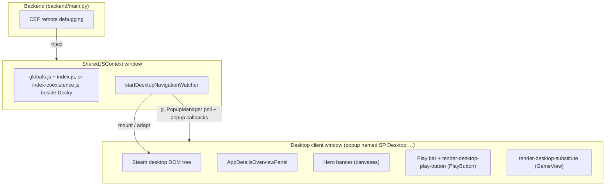
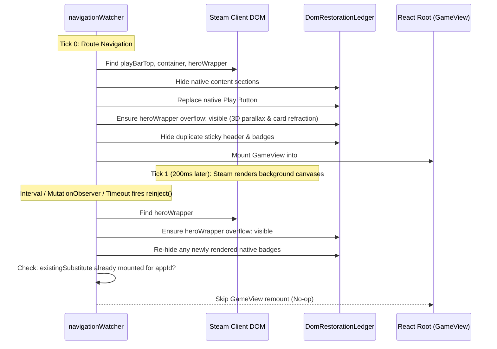

# Desktop Mode DOM Adaptation & Lifecycle Architecture

How Tender adapts Steam Desktop mode to display RomM game details, manage shortcuts, and handle the desktop lifecycle
without Decky Loader, monkey-patching, or fragile CSS scraping.

> **Dev build only.** Nothing on this page is in a shipped bundle. The watcher reaches Steam only through
> `pnpm -C frontend build:desktop`, which adds it to `src/index.tsx` at build time
> ([the desktop dev build](frontend-bundles.md#the-desktop-dev-build-dev-build-only)); `pnpm build`, `mise run dev`, CI
> and the release tarball carry none of `frontend/src/desktop/`.

---

## Dual-Window Execution Model

Tender operates across two separate Chromium Embedded Framework (CEF) window contexts in Steam Desktop mode:


```mermaid
flowchart TD
    subgraph Daemon ["Backend (backend/main.py)"]
        CEF["CEF remote debugging"]
    end

    subgraph SharedContext ["SharedJSContext window"]
        Panel["globals.js + index.js, or index-coexistence.js beside Decky"]
        DeskSupervisor["startDesktopNavigationWatcher"]
    end

    subgraph DesktopWindow ["Desktop client window (popup named SP Desktop …)"]
        SteamDOM["Steam desktop DOM tree"]
        OverviewPanel["AppDetailsOverviewPanel"]
        HeroBanner["Hero banner (canvases)"]
        InPagePlayBar["Play bar + tender-desktop-play-button (PlayButton)"]
        Substitute["tender-desktop-substitute (GameView)"]
    end

    CEF -->|"inject"| SharedContext
    DeskSupervisor -->|"g_PopupManager poll + popup callbacks"| DesktopWindow
    DeskSupervisor -->|"mount / adapt"| SteamDOM
```

1. **SharedJSContext**: The background context the backend injects the panel into over CEF remote debugging —
   `dist/globals.js` then `dist/index.js`, or `dist/index-coexistence.js` alone beside a serving Decky Loader
   ([loading the panel](loading-the-panel.md#which-bundles-and-the-rule-that-cannot-bend)). It hosts the desktop
   supervisor, the WebSocket connection to the backend, and the background sync managers.
2. **Desktop Client Window**: The popup `g_PopupManager.GetPopups()` lists under a name starting with `SP Desktop`
   (`findDesktopWindow`, `desktop/desktopWindow.ts`), containing the library overview, play bar, and game details. The
   supervisor looks for it on start, every 500 ms, and whenever Steam reports a popup created or destroyed; it detaches
   from a window that closed or was replaced and attaches to the new one.

Because plugin code executes from `SharedJSContext` while targeting nodes in the desktop client's window, the two
documents belong to separate JavaScript execution realms. An `instanceof` check against a DOM global (e.g. `Element` or
`Window`) will evaluate to `false` across realms. All constructors and observers must be drawn from the target node's
own realm (`el.ownerDocument.defaultView`).

### Which window is Steam's main UI

Measured in Steam's `SharedJSContext` on a Steam Deck in Desktop Mode:

- `SteamUIStore.MainInstanceUIMode` reads **7** while the desktop client is the main window (`SP Desktop_uid0`) and
  **4** while Big Picture is (`SP BPM_uid0`), and reads 7 again after leaving Big Picture.
- Steam **replaces** the main window rather than layering one over the other: while Big Picture was open, no
  `SP Desktop` popup was in `g_PopupManager.GetPopups()`, and after returning a **new** `SP Desktop_uid0` window
  existed. A reference to the desktop window does not outlive a trip through Big Picture, which is why the supervisor
  re-finds it.
- With the desktop client closed to the tray, the mode stays 7, the `SP Desktop_uid0` popup still exists,
  `MainWindowVisible` is true and the window's `document.hidden` is false. From JavaScript, a window hidden in the tray
  cannot be told apart from an open one.
- Game Mode was not measured. Tender reads every mode other than 7, and an unreadable `SteamUIStore`, as the desktop
  client not being the main UI.

### Dialogs for a start the launch watcher catches

A start Tender's Play button did not make — Steam's own Play, a `steam://rungameid` link — is caught by the launch
watcher (`utils/launchInterceptor.ts`), which may have questions to ask before the game starts. Which surface draws them
is decided once per start, as its gate begins, by `launchPromptsForThisStart` (`utils/launchPromptRouter.ts`): the
desktop dialogs while `MainInstanceUIMode` is 7 and the desktop surface has offered them and has a window, and Steam's
gamepad modals otherwise. The desktop surface offers them from `startDesktopNavigationWatcher` and withdraws them from
`stopDesktopNavigationWatcher`, so a bundle without the desktop surface — every shipped one — always asks through the
gamepad modals.

Such a start has no Tender page to draw from, so `askInDesktopWindow` (`desktop/launchPromptHost.tsx`) draws each
question into the body of the desktop window that exists at the moment it is asked: a container created with that
window's own `document.createElement`, and a React root from `findReactClient`. Each question keeps a
`DomRestorationLedger` of its own, which records the root, its container and the window's `pagehide` and `unload`
listeners, and `restoreAll()` takes all of it away when the question settles. A question settles with the button
pressed; with its dismissed answer on Escape or a click on the backdrop (as every `DesktopDialog` does), when its window
goes, or when the surface is withdrawn; and at once, with its dismissed answer, when there is no desktop window or
`createRoot` to draw with. Two starts caught together each draw a dialog of their own, one over the other, and Escape
then dismisses both.

**Known limitation:** because a tray-hidden desktop window looks open, a question for a start caught while the desktop
client sits in the tray is drawn into a window nobody sees until Steam is opened again, and the start waits for it. The
gamepad modals had the same exposure.

---

## Architectural Principles

### 1. Read-Only React Fiber Introspection (`watcher/fiberInspector.ts`)

In Big Picture mode, Tender patches into Steam's UI using Decky UI internals and component interception. In Desktop
mode, however, attempting to monkey-patch React reconciler internals or inject synthetic Fiber trees across execution
realms creates severe memory safety hazards and crashes the CEF renderer.

Instead, Tender employs **Read-Only React Fiber Introspection**:

- Inspects the internal `__reactFiber$` (or `__reactInternalInstance$`) expando property attached to native DOM
  elements.
- Reads component identities (`displayName` or `type.name`, walking up to the nearest non-HTML-tag name) to identify
  Steam structures (e.g. `PlayButton`, `AppActionButton`, the play bar and right controls).
- Reads the appId from the nearest ancestor's props — `appId`, `overview.appid` or `details.appid` — when the route
  (`MainWindowBrowserManager.m_lastLocation.pathname`, `/library/app/<appId>`) does not yield one.
- **Strict Invariant**: Fiber structures are strictly read-only. Never modify Fiber nodes, hooks, props, or linked
  lists.

### 2. Atomic DOM Restoration Ledger (`watcher/restorationLedger.ts`)

Desktop UI adaptations mutate native Steam DOM nodes (hiding default non-Steam placeholder notices, replacing play
buttons, making the play bar sticky, keeping the hero wrapper's overflow visible, and setting auto margins). An
untracked DOM mutation causes permanent layout corruption when navigating to non-RomM shortcuts or official Steam games.

The **`DomRestorationLedger`** guarantees atomic, idempotent restoration:

- **Style Recording**: When setting inline styles (e.g. `position: sticky`, `margin-left: auto`), the element's
  _original_ pre-mutation style is preserved in an internal map. Successive mutations preserve the earliest recorded
  value.
- **Visibility Tracking**: Hiding elements (`ledger.hide(el)`) backs up the initial `display` property and sets
  `display: none`. `ledger.unhide(el)` restores the exact prior display state.
- **Root Tracking**: Mounted React roots are tracked alongside their host container. `createRoot` is found in Steam's
  module registry (`findReactClient`, `desktop/desktopWindow.ts`), because Steam's React 19 keeps it in its own client
  module rather than on `SP_REACTDOM`.
- **Listener Tracking**: Attached event listeners are registered for guaranteed teardown.
- **Atomic Teardown**: `ledger.restoreAll()` detaches registered event listeners, unmounts all React roots and removes
  their hosts, then restores original displays and inline styles, in one pass — when the page leaves a RomM shortcut,
  when it moves to another RomM game, and when the watcher detaches from the window. A pass or a sticky-bar settle timer
  scheduled before that teardown does nothing once it has run, and the supervisor's popup callbacks, which nothing
  unregisters, do nothing once it has stopped.

### 3. Multi-Tier Resilient Selection Ladder (`watcher/elementSelectors.ts`)

Steam client desktop updates frequently re-minify and regenerate Webpack class names (e.g. `_3fLoY...`, `_3by_V...`).
Hardcoding these hashes creates brittle points of failure.

Each finder tries these strategies in order and takes the first that answers. Not every finder uses every rung, and a
finder may reorder the middle three (`findSteamPlayButton`, for one, checks a candidate's Fiber name before its ARIA
label and its text):

| Rung  | Strategy                 | Description                                                                                | Example                                                                                |
| :---- | :----------------------- | :----------------------------------------------------------------------------------------- | :------------------------------------------------------------------------------------- |
| **1** | Webpack CSS module token | The exact class `@decky/ui` resolved from Steam's own modules (`utils/deckyUiInternals`)   | `appDetailsClasses.PlayBar`, `appActionButtonClasses.PlayButtonContainer`              |
| **2** | Class-name substring     | The readable, PascalCase part of a module class name, which survives a re-hash of the rest | `[class*="PlayBar"]`, `[class*="AppDetailsOverviewPanel"]`, `[class*="RightControls"]` |
| **3** | Read-only Fiber name     | The nearest component name on the element's Fiber                                          | `/PlayButton\|AppActionButton/` on `getFiberDisplayName(el)`                           |
| **4** | ARIA label and text      | Accessible labels and visible text                                                         | `aria-label` matching `play`, `resume` or `launch`; a leaf reading `PLAY`              |
| **5** | Structural tree walk     | Traversal based on known parent/child layout relationships                                 | Nearest common ancestor between the play bar and the content sections                  |

**Rule**: Ephemeral minified class hashes are strictly forbidden in code. The hash-like names further down this page
describe Steam's DOM as measured; they are not selectors.

---

## Continuous Adaptation & The Async Layout Shift Trap

### The Lifecycle Problem

When a user selects a game in the desktop library:

1. Steam constructs the initial DOM skeleton (`overviewPanel`, `playBar`).
2. Tender's watcher detects the route and mounts `TENDER_SUBSTITUTE_ID` (`GameView`).
3. **Asynchronously (100–500ms later)**: Steam renders the rest of the page — the blurred background gradient canvases
   in the hero wrapper, the play bar's badges, and its duplicate sticky header.
4. An adaptation made only at mount never sees those elements: the badges and the duplicate header stay on screen, and
   the hero wrapper, which `findInflatedHeroWrapper` recognises by the canvases inflating its `scrollHeight`, is not
   there yet to be kept at `overflow: visible`.

### The Pass Order Invariant

An agent or developer might instinctively short-circuit `reinject()` if `existingSubstitute` is already mounted:

```ts
// ❌ DANGEROUS: Short-circuiting early breaks async layout adaptations!
if (existingSubstitute && existingSubstitute.isConnected && existingSubstitute.dataset.appid === String(appId)) {
  return;
}
// Keeping the hero wrapper visible, hiding badges, and duplicate sticky bar suppression NEVER RUN!
```

Because `GameView` mounts on tick 0 before the rest of the page renders, returning early skips every adaptation for what
renders later.

**The Invariant**: In `reinject()`, **DOM adaptations must precede the substitute mount guard**:


```mermaid
sequenceDiagram
    participant Watcher as navigationWatcher
    participant SteamDOM as Steam Client DOM
    participant Ledger as DomRestorationLedger
    participant ReactRoot as React Root (GameView)

    Note over Watcher: Tick 0: Route Navigation
    Watcher->>SteamDOM: Find playBarTop, container, heroWrapper
    Watcher->>Ledger: Hide native content sections
    Watcher->>Ledger: Replace native Play Button
    Watcher->>Ledger: Ensure heroWrapper overflow: visible (3D parallax & card refraction)
    Watcher->>Ledger: Hide duplicate sticky header & badges
    Watcher->>ReactRoot: Mount GameView into #tender-desktop-substitute

    Note over SteamDOM: Tick 1 (200ms later): Steam renders background canvases
    Note over Watcher: Interval / MutationObserver / Timeout fires reinject()
    Watcher->>SteamDOM: Find heroWrapper
    Watcher->>Ledger: Ensure heroWrapper overflow: visible
    Watcher->>Ledger: Re-hide any newly rendered native badges
    Watcher->>Watcher: Check: existingSubstitute already mounted for appId?
    Watcher-->>ReactRoot: Skip GameView remount (No-op)
```

1. **First, a stale `GameView`**: a substitute carrying another `appId`, or no longer in the insertion container, is
   torn down with everything the ledger holds. This happens before the adaptations, because a teardown after them would
   restore every one of them and leave Steam's own play bar on screen until the next pass.
2. **Always executed**, in this order: hide the native content sections; hide the native Play button and mount
   `PlayButton` in a root of its own beside it (remounted only when missing, detached, for another appId, or moved); set
   up or refresh the sticky play bar controller; keep the hero wrapper's overflow `visible`; hide Steam's duplicate
   sticky header; hide the native play bar badges; push the right controls to the right edge.
3. **Gated**: if a `GameView` for the current `appId` is still in place, return. Otherwise mount one after the play bar.

### Continuous Adaptation Mechanisms

To ensure layout containment remains locked regardless of when Steam finishes rendering:

- **Polling Loop (`checkNav`)**: Runs every 250ms via `deskWin.setInterval`. When `isMountedForCurrent` is true, it
  still calls `reinject()` to catch asynchronous layout shifts.
- **MutationObserver**: Observes `deskWin.document.body` for child list and subtree mutations.
- **RomM appId changes**: `onRomMAppIdsChanged` (`utils/rommAppIds.ts`) runs `reinject()` when the set of RomM shortcuts
  changes, so a page opened before its shortcut was registered is adapted once it is.
- **Settle timeouts**: every path change, and every attach to a window, also schedules `reinject()` at 100, 300 and 600
  ms.
- **Scroll Synchronization (`stickyPlayBarController.ts`)**: When the user scrolls, `updatePinning()` recalculates play
  bar glass/solid styling while maintaining `heroWrapper` overflow `visible` to allow the hero banner to scroll in 3D
  parallax behind the cards.

---

## Hero Banner Parallax & Glass Refraction Architecture

Steam Desktop's game details page features a signature visual effect where the hero banner artwork bleeds through a
semi-transparent glass play bar and scrolls at half speed behind content cards.

### Mechanics & Stacking Context

- **3D Parallax Perspective**:
  - The scroller (`_3lDczhulqraStjCitLYJ1K`) defines a 3D perspective context via
    `perspective: 1px; overflow-y: scroll;`.
  - The hero banner ancestors (`_2gZXhRmKUk68pA28-5ZmGQ` and `NZMJ6g2iVnFsOOp-lDmIP`) declare
    `transform-style: preserve-3d; overflow: visible;`.
  - The hero image container (`_1IX7FPSY9Jb82KhBVBSkZa`) applies
    `transform: matrix3d(2, 0, 0, 0, 0, 2, 0, 0, 0, 0, 1, 0, 0, 0, -1, 1)` (`scale(2) translateZ(-1px)`). In a 1px
    perspective context, `translateZ(-1px)` halves the scroll rate (0.5x parallax) while `scale(2)` scales the image
    back to 100% visual size.
  - The hero layer sits on `z-index: -1000`, placing it below normal document flow.

- **Play Bar Glass Overlay**:
  - **Unpinned**: `GLASS_PLAY_BAR_BG` (`rgba(36, 40, 47, 0.15)`) + subtle `GLASS_PLAY_BAR_GRADIENT` with
    `backdrop-filter: blur(12px)` on `z-index: 10`. The parallaxing hero banner bleeds through with a frosted refraction
    effect.
  - **Pinned**: When the play bar reaches the top of the scroller, `isPlayBarPinned` transitions the play bar to
    `SOLID_PLAY_BAR_BG` (`rgb(39, 44, 53)`) with `PINNED_PLAY_BAR_SHADOW`.

- **Card Refraction Persistence**:
  - The Tender cards container sits at `z-index: 1`. Each card uses a semi-transparent radial gradient
    (`STEAM_CARD_BG`).
  - Because `heroWrapper` preserves `overflow: visible`, the hero banner continues to scroll in 3D parallax behind the
    cards even after the play bar pins to the top, providing continuous artwork refraction across the remaining content.

### Bounding the artwork's overflow (`boundHeroOverflow`)

The hero image container — the parallax layer — is 307px tall, but what it holds runs much further: the image, then a
canvas Steam flips vertically to continue the blurred background below it (989px in all on the page measured). Chromium
counts that overflow towards the scroller's scrollable height at the layer's own scale, so on that page the scroller
reached 2 × 989 = 1978px against content ending at 1405px, and the page scrolled on past the last card into empty space.

Clipping the hero wrapper removes that, and flattens the parallax with it (above). `boundHeroOverflow`
(`watcher/stickyPlayBarController.ts`) clips one level lower instead, on the parallax layer itself, which is the end of
the 3D chain and already `transform-style: flat`, so nothing above it changes:

- **`overflow: clip`** on the layer, with an **`overflow-clip-margin`** that lets the artwork run on exactly as far as
  the page does. The layer's scrollable bottom is `layerTop + scale × (layer height + margin)`, measured on the device
  for margins from 400 to 600px, so the margin is `(target − layerTop) / scale − layer height`, rounded down. The target
  is the content's bottom, or the scroller's own height on a page shorter than the window.
- **A fade on the flipped canvas** over its last 160px before the clip edge, so the artwork ends in a gradient rather
  than on a straight line. The mask goes on the canvas rather than the layer: on the layer, a mask covers only the
  layer's own box, however its `mask-clip` is set, so it never reached the overflow.

Both are recomputed whenever the sticky controller updates its pinning — on scroll, on resize, and on every watcher pass
— because the cards change height, and both go through the ledger.

---

## Feature Parity & Roadmap

For a comprehensive comparison of features implemented in Big Picture mode versus Desktop mode, as well as the
multi-phase development roadmap for desktop parity, see the
[Desktop vs. Big Picture Feature Parity Matrix](desktop-parity-matrix.md).
